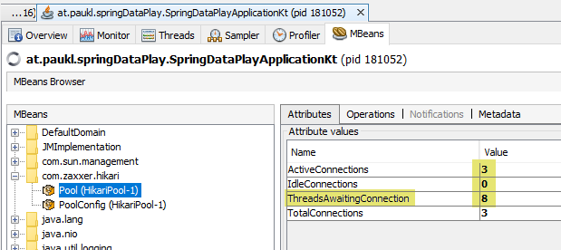

# Database Connection Pool Contention / "Pool Locking"

Example Repository that should help people understand the issue of Pool Locking.

## The Issue

The Spring `@Transactional` Annotation is a powerful tool to make transaction-management easy for developers.

As always: With great power, comes great responsibility / Know your tools.

Especially the variant `@Transactional(propagation = Propagation.REQUIRES_NEW)` can quickly become a trap (which I've personally witnessed multiple times already).

## What is Propagation.REQUIRES_NEW

Often people think of this propagation setting as "magically tells the database to make a nested transaction".
However **this mental model is wrong** - many Databases don't even have nested transactions, so something else needs to happen.

What actually happens is that Spring will **open a new connection to the database**. Of course acquiring it happens synchronously.

This can be problematic for at least 2 reasons:

**Scenario 1**: blocking resource allocation for a limited resource (connections from a pool) already sounds like something we might have heard in computer-science when we heard about deadlocks.
**Scenario 2**: handling 2 connections to the database at the same time where comitting one depends on comitting the other is also a bad idea - especially if the connections might operate on related tables.

### Deadlocks on all Sides

Quick recap on deadlocks: "[...] a state in which each member of a group waits for another member, including itself, to take action [...]" from [2]

In **Scenario 1** the deadlock happens on the Java-Side:

* There are 2 or more threads, each has acquired a database-connection (and thereby emptied the java db-connection pool).
* Now each thread wants to acquire another connection and thereby waits for the other threads to release them.
* The other threads to the same, so they would only release a connection after they got an additional one.

The only thing that will ever break/unblock this situation is a timeout on the connection-pool side.
That timeout is often configured to at least be a few seconds and by that time users / other systems are probably
already frantically retrying the problematic request, guaranteeing that the situation will stay bad.
The system will basically appear completely frozen/broken to almost all users, since the majority will only see error-responses and the few that actually do make it through will be slow.

In **Scenario 2** the deadlock may appear on the Database-Side: (albeit this is out of scope of this repositories' example)

* The Java-Process has opened a connection and e.g. inserted a new user in a table.
* Then the Java-Process (same thread) has opened another connection (via a call to a `@Transactional(propagation = Propagation.REQUIRES_NEW)` annotated method)
* In this second connection, it tries to insert something in a user-preferences table and use a foreign-key to the just inserted user.
* When the inner method is left and Spring tries to flush the "inner"-transaction (**second**-transaction is more accurate), the database will block.
* The database waits for the first connection to complete (commit) before it lets the second one commit.
* This is completely valid from the database's point of view, since those 2 connections are completely independent.
* However the Java-side introduced a blocking dependency which runs in the opposite direction (the inner method won't finish/return, so the calling method of course can't finish either).

NOTE: this depends on the concrete database used, but similar situations can probably be reproduced on most database systems with slightly altered scenarios - e.g. causing DB-side-locks some other way)


## Reproduction

Either we run the provided tests (the second one will fail to show the issue) or we start the application manually and then run the following command via the terminal — use either git bash or WSL on Windows.

```
seq 1 8 | xargs -I $ -n1 -P10  curl "http://localhost:8080/nested"
```

Note that this repository only shows scenario 1 (java-side) blocking.

## Identifying The Issue

What can we do if we think our application has this problem?
It may just be a feeling, but we how can we be sure?

If we can, we should activate logging from our connection-pool and tune parameters like `connectionTimeout` so that we'll see stacktraces of where issues occur.

Then a good approach would be the following:

1) Put the system under load (try to put a good amount of stress on the system - typically parallel requests) so that we start seeing problems.
2) Take some thread-dumps [4].
3) Analyze the thread-dump(s) and the logs.

We can collect this data by running the example-app and the provided bash-command.

**Logs**
If we are in the lucky situation (like with the example-app), to have enough log-statements in the code, the logs can already be enough to pinpoint the issue.

**No Logs**

Still, let’s pretend we aren’t so lucky to have these logs — or just not yet fully convinced.

In the thread-dumps we would see the following:

```
"http-nio-8080-exec-7" #43 daemon prio=5 os_prio=0 cpu=78.13ms elapsed=4400.45s tid=0x000001d9fa5ed000 nid=0x3a9b4 waiting on condition  [0x000000d541ffc000]
   java.lang.Thread.State: TIMED_WAITING (parking)
[...]
(4)	at com.zaxxer.hikari.HikariDataSource.getConnection(HikariDataSource.java:128)
	at org.springframework.jdbc.datasource.DataSourceTransactionManager.doBegin(DataSourceTransactionManager.java:265)
	at org.springframework.transaction.support.AbstractPlatformTransactionManager.startTransaction(AbstractPlatformTransactionManager.java:400)
	at org.springframework.transaction.support.AbstractPlatformTransactionManager.handleExistingTransaction(AbstractPlatformTransactionManager.java:434)
	at org.springframework.transaction.support.AbstractPlatformTransactionManager.getTransaction(AbstractPlatformTransactionManager.java:352)
	at org.springframework.transaction.interceptor.TransactionAspectSupport.createTransactionIfNecessary(TransactionAspectSupport.java:595)
(3)	at org.springframework.transaction.interceptor.TransactionAspectSupport.invokeWithinTransaction(TransactionAspectSupport.java:382)
[...]
	at org.springframework.aop.framework.CglibAopProxy$DynamicAdvisedInterceptor.intercept(CglibAopProxy.java:698)
	at at.paukl.springDataPlay.DemoService$$EnhancerBySpringCGLIB$$a7f6a283.requiresNewTransaction(<generated>)
(2)	at at.paukl.springDataPlay.DemoController.nested(DemoController.kt:28)
[...]
	at org.springframework.aop.framework.CglibAopProxy$CglibMethodInvocation.proceed(CglibAopProxy.java:753)
	at org.springframework.transaction.interceptor.TransactionInterceptor$1.proceedWithInvocation(TransactionInterceptor.java:123)
(1)	at org.springframework.transaction.interceptor.TransactionAspectSupport.invokeWithinTransaction(TransactionAspectSupport.java:388)
	at org.springframework.transaction.interceptor.TransactionInterceptor.invoke(TransactionInterceptor.java:119)
[...]
	at java.lang.Thread.run(java.base@12.0.1/Thread.java:835)


"http-nio-8080-exec-16" #68 daemon prio=5 os_prio=0 cpu=15.63ms elapsed=709.22s tid=0x000001d9fa5f1000 nid=0x3e39c waiting on condition  [0x000000d5421fc000]
   java.lang.Thread.State: TIMED_WAITING (parking)
[...]
	at com.zaxxer.hikari.HikariDataSource.getConnection(HikariDataSource.java:128)
	at org.springframework.jdbc.datasource.DataSourceTransactionManager.doBegin(DataSourceTransactionManager.java:265)
	at org.springframework.transaction.support.AbstractPlatformTransactionManager.startTransaction(AbstractPlatformTransactionManager.java:400)
[...same as above...]
```

NOTE: I removed lots of things to make it easier to see - but once you know what you're looking for, this is easy.

We see that:

(1) The outer transaction got started (acquired a connection).  
(2) Our own code runs, which tries to call a service-method, but before it gets there...  
(3) ...the spring-proxy takes over to do the transaction-handling and tries to create a separate tarnsaction.  
(4) That code is waiting for a connection.  

Also we see that there are multiple other threads running which are blocked at exactly the same place.
Even if we look at a thread-dump taken a few seconds later, it will still look the same, so we may assume that the execution hasn't progressed from where it was. 

**Other Metrics/Indicators**

If we have access to other metrics like JMX-Values, those can be good indicators too.

In this screenshot of JVisualVM, we see the current status of the Hikari Connection-Pool while the load-bash-script is running:



Pool-status showing us that lots of connections are waiting (requested from the pool, but could not be provided yet).

What we expect to see to confirm our theory that our application is suffering from pool-locking is this: The values stay high (don’t change) while we refresh a few times and our simulated clients (curl-commands) don’t make any progress. 

## Possible Solutions

There are basically 3 ways this can be fixed:

* Getting rid of the "nested" transaction. It might not be necessary at all to have 2 separate transactions. If that's the case, just get rid of it by using the default propagatino level.
* Serializing the 2 transactions. Instead of having an inner transaction that is started after the first, but must finish before the first, it might be an option to just have 2 separate transaction after one another.
  * The easiest way is to just have 1 outer method which isn't transactional which then calls 2 transactional services after one another.
  * If that isn't so easy, Springs `TransactionSynchronizationManager.registerSynchronization` [3] might be worth a try. That way we can register some code that runs once the current transaction finished.
* Limiting the concurrency on the calling side to a level that guarantees the case will never be hit. This could be done in a number of ways.
  * One way would be to reduce the allowed parallelism of allowed incoming connections (http).
  * Another way is to introduce some other limiting-code (e.g. only around the parts of the application which is known to need nested transactions).
  * The right limit depends on a few factors: the amount of nesting the application has (every level of nested calls to `Propagation.REQUIRES_NEW` adds another connection that is required by a single thread), the database connection pool settings and the amount of otherwise occupied db-connections.
  * Also keep in mind that other parts of the application might also occupy db-connections: frequently running tasks, long-running jobs, message-queue-message-processing, RPC-endpoints etc. `@Transactional(propagation = Propagation.REQUIRES_NEW)` is simply a great tool which I've seen being used in problematic ways multiple times by now.


## Caveats

1) "Just increase the pool-size" is NOT a solution.
And it's not even a good workaround for any system of meaningful size - see [1].
Of course for any application the db-connection-pool should have an appropriate size - but after reading [1] we might realize that it's lower than we initially thought.
2) This is NOT an issue with the HikariCP Connection-Pool. If anything, HikariCP gives us great tools (like `leak-detection-threshold`) to identify such issues and many other parameters to properly tune our connection-pools.
3) This is also NOT a problem/bug in Spring or even Java-specific. Any system can have this issue if it has the following property: a pooling mechanism with a fixed upper-bound and multiple nested and blocking requests to it.

## Conclusion

Should we never again use `@Transactional(propagation = Propagation.REQUIRES_NEW)`?
No, I would not go that far.

Should we question if we really need it, every time we intend to use it?
Yes, definitely. In my experience, the code system usually becomes easier to reason about, once we have gotten rid of the “handling 2 db connections at the same time” aspect of it.

## Further Reading

[1] https://github.com/brettwooldridge/HikariCP/wiki/About-Pool-Sizing  
[2] https://en.wikipedia.org/wiki/Deadlock  
[3] https://docs.spring.io/spring-framework/docs/current/javadoc-api/org/springframework/transaction/support/TransactionSynchronizationManager.html  
[4] https://www.baeldung.com/java-thread-dump  
